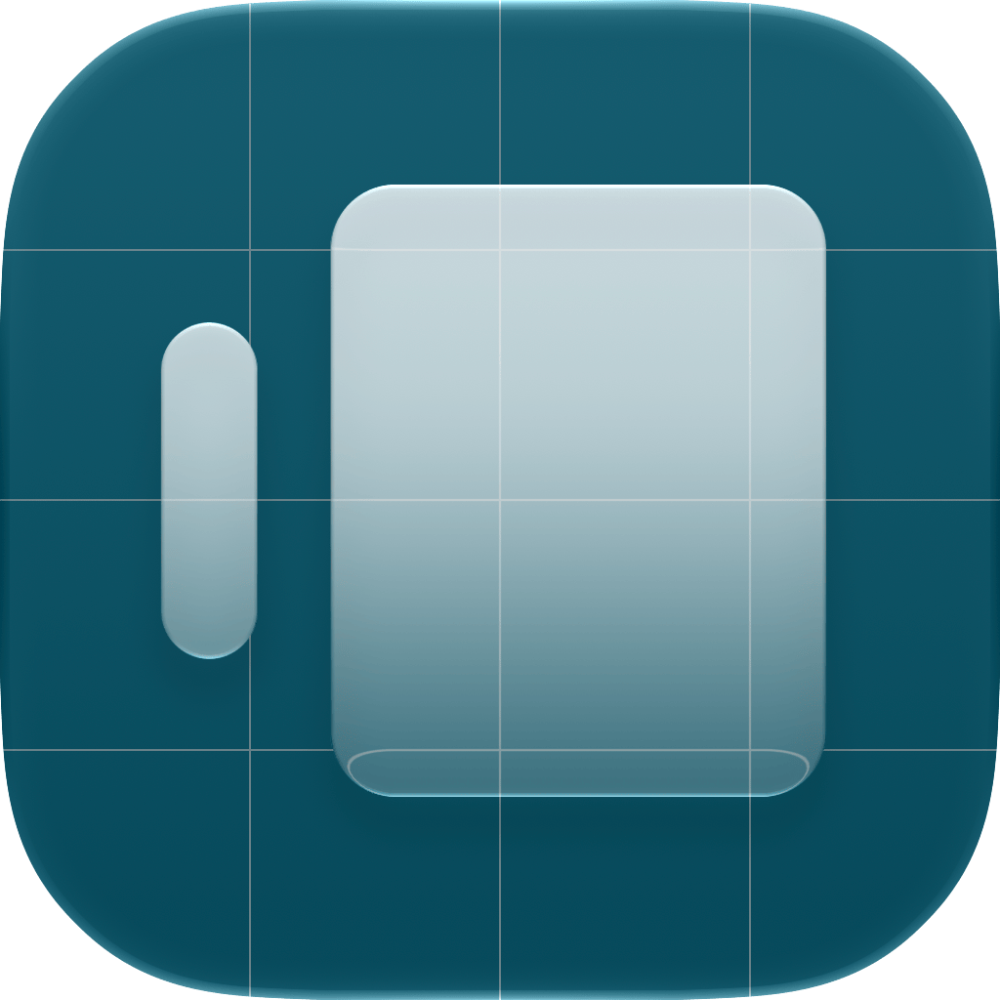
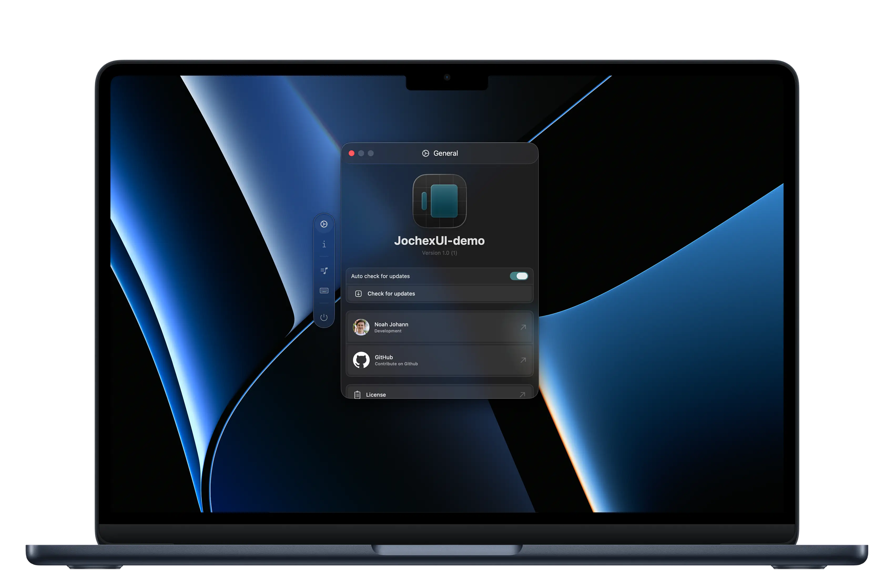

<div align="center">
  <a href="https://github.com/Noah-Johann/JochexUI/">
    
  </a>

  <h1 align="center">JochexUI</h1>
</div>



## Features

- Translucent design with Liquid Glass elements that feel native on Mac.
- Optional floating Tabbar in a visionOS design.
- Available on both macOS 26 and higher with Liquid Glass and on pre-Tahoe.
- Works great with [Luminare](https://github.com/MrKai77/Luminare) components.

## Installation
You can use the Swift Package Manager in Xcode to add JochexUI to your target.
Go to `File` > `Add Package Dependencies...` and paste the project url into the search field.


## Usage

You can use a JochexWindow just like a normal window.
```swift
let window = JochexWindow() {
  PaneView()
} tabBar: {
  TabBarView()
}
window.makeKeyAndOrderFront()
```
<br/>

To add a tabbar, use a JochexTabBar together with JochexTabBarSections. 

```swift
JochexTabBar(glass: false, isExpanded: $navigationManager.isExpanded) {
  JochexTabBarSection(
    selectedTab: $navigationManager.selection,
    isExpanded: $navigationManager.isExpanded,
    tabs: [Tab.general, .about]
  )
            
  JochexTabBarSection(
    "Section title",
    selectedTab: $navigationManager.selection,
    isExpanded: $navigationManager.isExpanded,
    tabs: [Tab.music, .lockscreen]
  )
            
  JochexTabBarSection(
    selectedTab: $navigationManager.selection,
    isExpanded: $navigationManager.isExpanded,
    tabs: [Tab.quit]
  ) { Divider() }
}
```

<br/>

A tab item has to follow this structure. You can add an action that is executed when the tab is clicked.
```swift
enum Tab: JochexTabItem {
  case tab, ...
  var name: LocalizedStringKey
  var icon: View
  var buttonAction: () -> () {
}
```

<br/>

You can take a look at [MusicNotch](https://github.com/Noah-Johann/MusicNotch) for an example usage.

## System Requirements
- **macOS 14 Sonoma or later**

## Acknowledgments
Code for JochexUI was partly taken and inspired by [Luminare](https://github.com/MrKai77/Luminare)

## License
JochexUI is licensed under the BSD 3-Clause License. See [`LICENSE`](/LICENSE) for more details.


